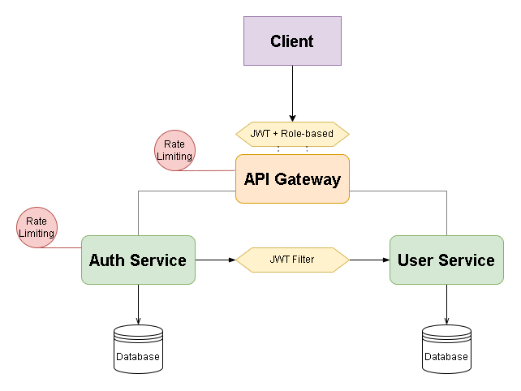
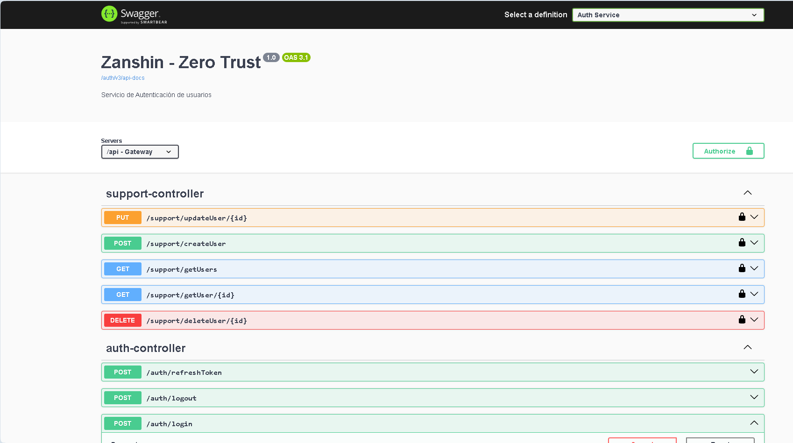
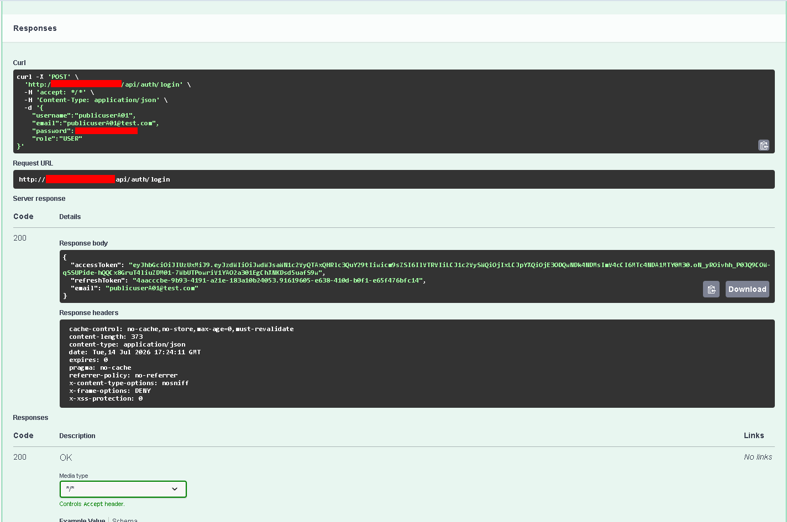
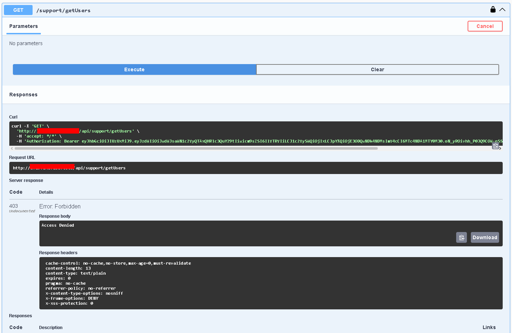
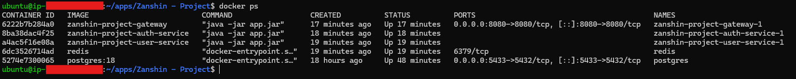
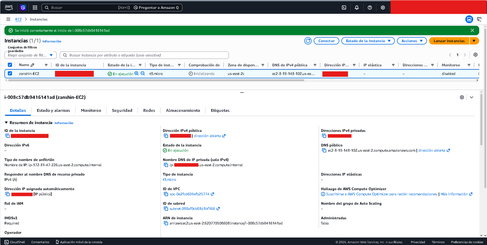

# 🛡️ Zanshin - Zero Trust Authentication System

> A microservices-based authentication platform implementing Zero Trust principles using Spring Boot, Spring Security, JWT, Docker and AWS.


---

## 📖 Overview

Zanshin is a backend authentication platform designed following the **Zero Trust** security model.

Instead of assuming trust inside a network, every request must be authenticated and authorized before accessing protected resources.

The system is built using a **microservices architecture**, where authentication, user management and routing are separated into independent services.

---

## ✨ Features

- JWT Authentication
- Role-Based Access Control (RBAC)
- API Gateway
- Microservices Architecture
- Redis Integration
- PostgreSQL Database
- Dockerized Services
- Swagger/OpenAPI Documentation
- AWS EC2 Deployment

---

# 🏗 Architecture

```
                    Client       
                       │
                       ▼
            Spring Cloud Gateway(JWT + Redis + Role-Based Access Control)
                       │
        ┌──────────────┴──────────────┐
        ▼                             ▼
 Auth Service (Redis)            User Service
        │                             │
     PostgreSQL                     PostgreSQL
```

---

## ⚙️ Technologies

| Technology | Purpose |
|------------|----------|
| Java 17 | Backend |
| Spring Boot | REST APIs |
| Spring Security | Authentication |
| Spring Cloud Gateway | API Gateway |
| JWT | Stateless Authentication |
| PostgreSQL | Database |
| Redis | Token/Cache Management |
| Docker | Containerization |
| Docker Compose | Service Orchestration |
| AWS EC2 | Deployment |
| Swagger/OpenAPI | API Documentation |

---

# 📁 Project Structure

```
zanshin/

├── api-gateway/
├── auth-service/
├── user-service/
├── resources/
├── .env
├── .gitignore
├── docker-compose.yml
└── README.md
```

---

# 🚀 Running Locally

## Clone

```bash
git clone https://github.com/John3315x/zanshin-zero-trust-system

cd zanshin
```

## Build

```bash
docker compose build
```

## Start

```bash
docker compose up -d
```

Verify containers:

```bash
docker ps
```

---

# 🌐 Services

| Service | Port |
|----------|------|
| Gateway | 8080 |
| Auth Service | 8081 |
| User Service | 8082 |
| PostgreSQL | 5432 |
| Redis | 6379 |

---

# 🔑 Authentication Flow

1. Register a new user.
2. Login with credentials.
3. Receive a JWT.
4. Send the JWT in the Authorization header.

```
Authorization: Bearer <token>
```

5. Gateway validates the token.
6. Request is forwarded to the target service.

---

# 📚 API Documentation

Swagger UI is available after deployment.

Example:

```
http://localhost:8080/webjars/swagger-ui/index.html
```

---

# 🐳 Docker

Start services

```bash
docker compose up -d
```

Stop services

```bash
docker compose down
```

View logs

```bash
docker compose logs
```

---

# ☁ AWS Deployment

The application is deployed on an **Amazon EC2** Ubuntu instance.

Deployment includes:

- Docker Engine
- Docker Compose
- PostgreSQL
- Redis
- Spring Boot Microservices

---

# 🔒 Zero Trust Principles

Zanshin follows these security concepts:

- Never trust, always verify
- JWT validation on every request
- Stateless authentication
- Role-based authorization
- Gateway as a single entry point

---

# 📸 Screenshots

## Architecture



---

## Swagger







---

## Docker Containers



---

## AWS EC2



---

# 📈 Future Improvements

- Refresh Tokens
- Audit Logging
- Rate Limiting
- Prometheus Monitoring
- Grafana Dashboards
- CI/CD with GitHub Actions
- HTTPS with Nginx & Let's Encrypt
- Kubernetes Deployment

---

# 👨‍💻 Author

**John Chaves**

Backend Developer

- Java
- Spring Boot
- Docker
- AWS
- PostgreSQL
- Redis
